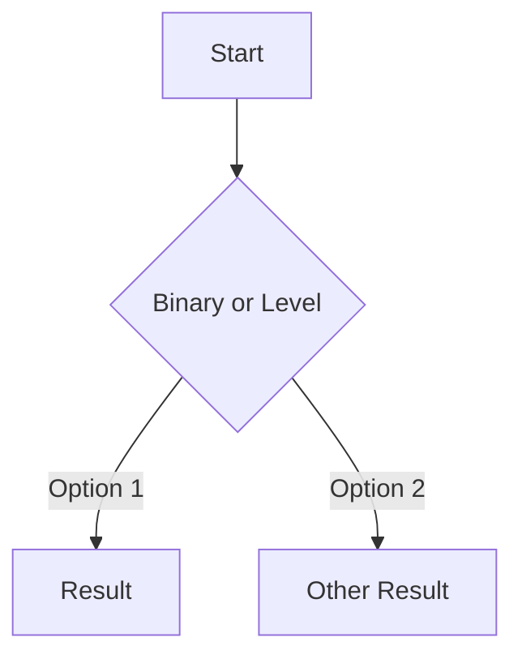
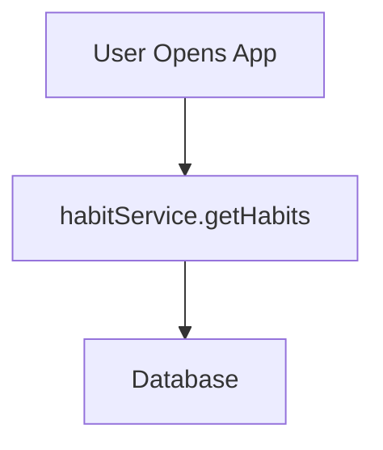

# AGENTS.md - Code Guro

This document provides essential context for AI agents and developers working with the Code Guro codebase.

---

## 1. Tech Stack & Dependencies

### Core Runtime
- **Python 3.8+** (tested on 3.8, 3.9, 3.10, 3.11, 3.12)
- Package manager: pip with setuptools

### Production Dependencies

| Package | Version | Purpose |
|---------|---------|---------|
| `anthropic` | >=0.18.0 | Anthropic Claude API client |
| `openai` | >=1.0.0 | OpenAI GPT-4o API client |
| `google-generativeai` | >=0.3.0 | Google Gemini API client |
| `click` | >=8.0 | CLI framework for command structure |
| `rich` | >=13.0 | Terminal formatting, progress bars, panels |
| `gitpython` | >=3.1 | Git repository cloning and manipulation |
| `tiktoken` | >=0.5.0 | Token counting for cost estimation |
| `markdown` | >=3.4 | Markdown to HTML conversion |

### Development Dependencies

| Package | Version | Purpose |
|---------|---------|---------|
| `pytest` | >=7.0 | Testing framework |
| `pytest-cov` | >=4.0 | Code coverage reporting |
| `black` | >=23.0 | Code formatter (100 char line length) |
| `ruff` | >=0.1.0 | Fast Python linter |

### Optional Enhanced Features
- `python-dotenv>=1.0` - Environment variable management
- `prompt_toolkit>=3.0` - Interactive REPL enhancements
- `pygments>=2.15` - Syntax highlighting

### Environment Requirements
- Internet connection required (connects to provider APIs)
- LLM provider API key (set via environment variables):
  - **Anthropic**: `ANTHROPIC_API_KEY` or `CLAUDE_API_KEY` (backwards compatibility)
  - **OpenAI**: `OPENAI_API_KEY`
  - **Google**: `GOOGLE_API_KEY` or `GEMINI_API_KEY` (backwards compatibility)
- Provider selection via `code-guro configure` (stored in `~/.config/code-guro/config.json`)
- Token encoding: `cl100k_base` (for Anthropic/OpenAI), provider-specific for Google Gemini

---

## 2. Project Structure

```
code-guro/
├── src/code_guro/           # Main application package
│   ├── __init__.py          # Package version (0.4.2)
│   ├── cli.py               # CLI entry point - Click commands
│   ├── analyzer.py          # Codebase analysis engine
│   ├── generator.py         # Documentation generation via LLM
│   ├── frameworks.py        # Framework detection (Next.js, React, Django, etc.)
│   ├── prompts.py           # LLM prompt templates
│   ├── config.py            # Provider selection and configuration
│   ├── providers/            # LLM provider abstraction layer
│   │   ├── __init__.py      # LLMProvider base class
│   │   ├── factory.py       # Provider factory
│   │   ├── anthropic_provider.py  # Anthropic Claude implementation
│   │   ├── openai_provider.py     # OpenAI GPT-4o implementation
│   │   └── gemini_provider.py     # Google Gemini implementation
│   ├── utils.py             # Token counting, file handling utilities
│   ├── errors.py            # Custom exception hierarchy
│   ├── repl.py              # Interactive conversation mode
│   ├── html_converter.py    # Markdown to HTML conversion
│   ├── templates/           # Mermaid diagram templates
│   ├── config_test.py       # Config module tests
│   ├── frameworks_test.py   # Framework detection tests
│   └── utils_test.py        # Utility function tests
├── tests/                   # Additional test directory
│   ├── __init__.py
│   └── integration/         # Integration tests
├── assets/                  # Documentation assets (screenshots, images)
├── samples/                 # Local reference outputs (git-ignored content)
│   ├── README.md            # Purpose & regeneration docs (committed)
│   ├── markdown/            # Sample markdown outputs (git-ignored)
│   └── html/                # Sample HTML outputs (git-ignored)
├── rules/                   # PRD and development guidelines
├── tasks/                   # Project task lists and documentation
├── pyproject.toml           # Project configuration (dependencies, tools)
├── setup.py                 # Minimal setuptools shim
├── README.md                # User documentation
└── .gitignore               # Git ignore rules
```

### Architectural Pattern
- **Modular CLI application** with clear separation of concerns
- **Data classes** for structured data (`FileInfo`, `AnalysisResult`, `FrameworkInfo`)
- **Decorator pattern** for cross-cutting concerns (API key validation, internet checks)

### Data Flow
```
CLI Input → Analyzer (file traversal, framework detection)
         → Generator (LLM API calls via provider abstraction)
         → Markdown files (code-guro-output/markdown/)
         → HTML Converter (optional, default enabled)
         → HTML files (code-guro-output/html/)
```

### Provider Architecture
```
CLI/Generator → Provider Factory → Selected Provider (Anthropic/OpenAI/Gemini)
                                      ↓
                              Provider-specific SDK
                                      ↓
                              LLM API Response
```

The provider abstraction layer (`providers/`) allows Code Guro to support multiple LLM providers:
- **AnthropicProvider**: Wraps Anthropic Claude API
- **OpenAIProvider**: Wraps OpenAI GPT-4o API
- **GeminiProvider**: Wraps Google Gemini API

All providers implement the `LLMProvider` interface with methods: `call()`, `validate_api_key()`, `estimate_cost()`, `count_tokens()`.

---

## 3. Development Commands

### Installation

```bash
# Install in development mode with dev dependencies
pip install -e ".[dev]"

# Set up pre-commit hooks (recommended - auto-formats code before commits)
pre-commit install

# Install with enhanced REPL features
pip install -e ".[enhanced]"

# Install everything (dev + enhanced)
pip install -e ".[all]"
```

### Testing

```bash
# Run all tests with verbose output
pytest

# Run specific test file
pytest src/code_guro/config_test.py
pytest src/code_guro/frameworks_test.py
pytest src/code_guro/utils_test.py

# Run with coverage
pytest --cov

# Run only tests matching a pattern
pytest -k "test_token"
```

### Code Quality

**ALWAYS run before committing**:
```bash
# Recommended: Run all quality checks at once
make quality

# Or use individual commands:
make format       # Format code with Black
make lint         # Check and fix linting with Ruff
make test         # Run tests
make pre-commit   # Run pre-commit on all files
make clean        # Clean up cache files

# Manual commands (if not using make):
black src/              # Format code
ruff check src/ --fix   # Check and fix linting
pytest                  # Run tests
```

**Pre-commit hooks**: If installed (`pre-commit install`), these checks run automatically before each commit and will:
- Auto-format code with Black
- Auto-fix import sorting and remove unused imports with Ruff
- Prevent commits if tests fail or linting errors remain

**CI/CD**: GitHub Actions runs the same checks on every push. If you skip pre-commit hooks, the CI will catch issues.

### CLI Commands

```bash
# Configure provider and API key
code-guro configure
# Selects provider and validates API key from environment variable

# Analyze a local codebase (generates both HTML and markdown by default)
code-guro analyze .
code-guro analyze /path/to/project
code-guro analyze . --markdown-only  # Generate only markdown

# Analyze a GitHub repository
code-guro analyze https://github.com/user/repo

# Convert markdown-only output to include HTML
code-guro convert
code-guro convert /path/to/output

# Deep dive into specific files/folders
code-guro explain ./src/auth
code-guro explain ./src/auth --interactive
code-guro explain ./src/auth --output console

# Display version
code-guro --version
```

---

## 4. Testing Strategy

### Test Framework
- **pytest** with verbose output and short tracebacks
- Test discovery: files matching `*test*.py` or `test_*.py`
- Test paths: `src/` and `tests/` directories

### Test Configuration (pyproject.toml)
```toml
[tool.pytest.ini_options]
testpaths = ["src", "tests"]
python_files = ["*test*.py", "test_*.py"]
addopts = "-v --tb=short"
```

### Test Organization
Tests are colocated with source files in `src/code_guro/`:

| Test File | Coverage |
|-----------|----------|
| `config_test.py` | API key storage, environment variables, file permissions |
| `frameworks_test.py` | Framework detection for Next.js, React, Vue, Django, Flask, Express, Rails |
| `utils_test.py` | Token counting, cost estimation, file type detection |

### Test Patterns
- Class-based organization (e.g., `TestConfigDir`, `TestFrameworkMetadata`)
- Uses mocking and fixtures for isolated testing
- Tests cover edge cases: empty files, missing keys, invalid inputs

### Example Test Structure
```python
class TestTokenCounting:
    def test_count_tokens_empty_string(self):
        assert count_tokens("") == 0

    def test_count_tokens_with_content(self):
        result = count_tokens("Hello world")
        assert result > 0
```

---

## 5. Code Style & Standards

### Formatting (Black + Ruff)
- **Line length**: 100 characters
- **Target Python**: 3.8+
- **Ruff rules enabled**: E (pycodestyle), F (pyflakes), W (whitespace), I (isort), B (bugbear), C4 (comprehensions)
- **Ignored**: E501 (line too long - handled by Black)
- **Note**: UP (upgrades) rule is NOT enabled to maintain Python 3.8 compatibility (e.g., use `Optional[str]` not `str | None`)

### Naming Conventions

| Type | Convention | Example |
|------|------------|---------|
| Constants | UPPER_CASE | `MAX_FILE_SIZE`, `SAFE_CONTEXT_TOKENS` |
| Classes | PascalCase | `FileInfo`, `AnalysisResult` |
| Functions | snake_case | `analyze_codebase()`, `count_tokens()` |
| Boolean functions | Prefixed | `is_binary_file()`, `check_internet()` |
| Private functions | Underscore prefix | `_validate_key()` |

### Type Hints
- Full type hints throughout codebase
- Uses `Optional`, `List`, `Dict`, `Tuple` from typing
- Dataclasses with typed fields

### Docstring Style
```python
def analyze_codebase(path: str, max_files: int = 500) -> AnalysisResult:
    """Analyze a codebase and return structured results.

    Args:
        path: Path to the codebase directory or GitHub URL
        max_files: Maximum number of files to analyze

    Returns:
        AnalysisResult containing file info and framework detection

    Raises:
        AnalysisError: If the path is invalid or inaccessible
    """
```

### Import Organization
**CRITICAL**: Ruff enforces import sorting (I rule). Always organize imports as follows:

1. **Standard library imports** (e.g., `from pathlib import Path`)
2. **Third-party imports** (e.g., `import pytest`, `from click.testing import CliRunner`)
3. **Local imports** (e.g., `from code_guro.cli import main`)

**Blank lines**: One blank line between each group, no blank lines within a group.

**Example**:
```python
from pathlib import Path
from unittest.mock import Mock

import pytest
from click.testing import CliRunner

from code_guro.analyzer import AnalysisResult
from code_guro.cli import main
```

**Before committing**: Run `make quality` or `pre-commit run --all-files` to auto-fix import sorting.

### Error Handling Pattern
- Custom exception hierarchy with `CodeGuroError` base class
- Specific exceptions: `ConfigurationError`, `APIKeyError`, `AnalysisError`, `NetworkError`, `GitHubError`
- User-friendly messages with hints in `ERROR_MESSAGES` dictionary

---

## 6. Boundaries & Constraints

### NEVER Modify or Commit

| Category | Items |
|----------|-------|
| **Secrets** | API keys, `~/.config/code-guro/config.json`, `.env` files |
| **Generated Output** | `code-guro-output/` directory with `html/` and `markdown/` subdirectories (analysis results) |
| **Virtual Environments** | `venv/`, `.venv/`, `env/` |
| **Cache Directories** | `__pycache__/`, `.pytest_cache/`, `.ruff_cache/` |
| **Build Artifacts** | `build/`, `dist/`, `*.egg-info/` |
| **IDE Settings** | `.idea/`, `.vscode/` (unless shared configs) |

### File Filtering Rules (in analyzer.py)
These patterns are automatically skipped during analysis:

```python
ALWAYS_SKIP = {".git", "node_modules", "venv", ".venv", "__pycache__",
               ".pytest_cache", "dist", "build", ".next", ".nuxt"}
```

### Binary Extensions (30+ types)
Images, audio, archives, executables, and documents are automatically skipped.

### Size Limits
- **Max file size**: 1MB (larger files skipped)
- **Max context tokens**: 150,000 (safe working limit)
- **Max total tokens**: 200,000 (absolute limit)

### Deprecated Patterns to Avoid
- Direct API calls without error handling
- Hardcoded API keys
- Synchronous file operations for large files
- Print statements (use `rich.console.Console` instead)

### API Cost Awareness
Cost estimation is provider-specific:
- **Anthropic Claude Sonnet 4**: $3.00 / $15.00 per million tokens (input/output)
- **OpenAI GPT-4o**: $2.50 / $10.00 per million tokens (input/output)
- **Google Gemini 2.0 Flash**: $0.075 / $0.30 per million tokens (input/output)
- Cost confirmation threshold: $1.00 (prompts user)
- Always estimate costs before processing using the selected provider's pricing

---

## 7. Git Workflow

### Branching Strategy
- **`main`**: Production-ready code, always stable
- **`feature/*`**: Feature branches for new functionality
- Example: `feature/chunked-analysis`, `feature/code-guro-mvp`

### Commit Message Conventions
Follow conventional commits pattern:
```
<type>: <description>

[optional body]

[optional footer]
```

Types:
- `feat`: New feature
- `fix`: Bug fix
- `docs`: Documentation changes
- `refactor`: Code refactoring
- `test`: Adding or updating tests
- `chore`: Maintenance tasks

### PR Requirements
- Feature branches merge to `main` via Pull Request
- PRs should include description of changes
- Tests should pass before merge

### Pre-commit Checks

**Automatic (Recommended):**
If you ran `pre-commit install`, checks run automatically before each commit.

**Manual:**
```bash
make quality  # Run all checks at once

# Or individually:
make format   # Format code
make lint     # Lint and auto-fix
make test     # Run tests
```

### Python 3.8 Compatibility
**CRITICAL**: Since we target Python 3.8+, you MUST:
- Use `List[str]`, `Dict[str, int]` from `typing` (NOT `list[str]`, `dict[str, int]`)
- Use `Optional[str]` from `typing` (NOT `str | None`)
- Avoid modern type union syntax (`X | Y`) - use `Union[X, Y]` instead

**Why**: Python 3.8 doesn't support PEP 604 union syntax (`X | None`) or PEP 585 generic syntax (`list[str]`).

**Example**:
```python
from typing import Optional, List, Dict

def get_api_key() -> Optional[str]:  # ✅ Correct
    pass

def get_files() -> List[str]:  # ✅ Correct
    pass

# ❌ WRONG (requires Python 3.10+)
# def get_api_key() -> str | None:
# def get_files() -> list[str]:
```

### .gitignore Categories
```
# Python artifacts
__pycache__/, *.pyc, *.pyo

# Testing
.pytest_cache/, .coverage, htmlcov/

# Virtual environments
venv/, .venv/, env/

# IDE
.idea/, .vscode/, *.swp

# Build
build/, dist/, *.egg-info/

# Project-specific
code-guro-output/
```

---

## 8. Common Linting Issues & Solutions

### I001: Import block is un-sorted or un-formatted

**Problem**: Imports are not organized correctly.

**Solution**: Run `ruff check src/ --fix` to auto-fix, or organize manually:
```python
# ✅ Correct order
from pathlib import Path
from unittest.mock import Mock

import pytest
from click.testing import CliRunner

from code_guro.cli import main
```

### F401: Imported but unused

**Problem**: You imported something but never used it.

**Solution**: Remove the unused import, or if you need it later, add `# noqa: F401` comment:
```python
from typing import Optional  # noqa: F401  # Used in type comments
```

### F811: Redefinition of unused variable

**Problem**: You imported something at the top, then imported it again locally.

**Solution**: Remove the duplicate import. Use the top-level import instead:
```python
# ❌ Bad
from code_guro.analyzer import AnalysisResult  # Top of file

def test_something():
    from code_guro.analyzer import AnalysisResult  # Duplicate!

# ✅ Good
from code_guro.analyzer import AnalysisResult  # Top of file

def test_something():
    result = AnalysisResult(...)  # Use the top-level import
```

### E501: Line too long

**Problem**: Line exceeds 100 characters.

**Solution**: Black handles this automatically. Run `black src/` to fix.

### Quick Fix Commands

```bash
# Fix all auto-fixable issues
ruff check src/ --fix

# Format all code
black src/

# Run everything
make quality
```

---

## Quick Reference

### Key Files for Common Tasks

| Task | Files to Modify |
|------|-----------------|
| Add CLI command | `src/code_guro/cli.py` |
| Modify analysis logic | `src/code_guro/analyzer.py` |
| Add new framework | `src/code_guro/frameworks.py` |
| Change Claude prompts | `src/code_guro/prompts.py` |
| Update error messages | `src/code_guro/errors.py` |
| Modify output format | `src/code_guro/generator.py` |
| Update HTML conversion | `src/code_guro/html_converter.py` |
| View sample outputs | `samples/markdown/`, `samples/html/` |
| Update pre-commit hooks | `.pre-commit-config.yaml` |
| Add make commands | `Makefile` |

### Critical Constants (in utils.py)

```python
MAX_FILE_SIZE = 1_000_000        # 1MB
SAFE_CONTEXT_TOKENS = 150_000   # Safe working limit
MAX_CONTEXT_TOKENS = 200_000    # Absolute limit
INPUT_COST_PER_TOKEN = 0.000003  # $3/million
OUTPUT_COST_PER_TOKEN = 0.000015 # $15/million
```

### Default Models Per Provider
```python
# Anthropic
MODEL = "claude-sonnet-4-20250514"

# OpenAI
MODEL = "gpt-4o-2024-11-20"

# Google Gemini
MODEL = "gemini-2.0-flash-exp"
```

Models are hardcoded per provider for optimal capability/cost balance. Users select provider during `code-guro configure`, and the appropriate model is used automatically.

---

## Notes for AI Agents

1. **This is a Python CLI tool** - all source code is in `src/code_guro/`
2. **Tests are colocated** - test files live alongside source files
3. **Rich console is preferred** - use `rich.console.Console` for all output
4. **Cost awareness is critical** - always consider token costs when modifying prompts
5. **The tool generates documentation** - output goes to `code-guro-output/` directory with `html/` and `markdown/` subdirectories (dual format by default)
6. **HTML is the default format** - provides fully rendered Mermaid diagrams; markdown is for version control/GitHub viewing
7. **Framework detection is extensible** - add new frameworks in `frameworks.py`
8. **API key is stored securely** - mode 0o600 in user config directory
9. **Reference samples available** - the `samples/` directory contains example Markdown and HTML outputs for "Your Amazing App". Use these as reference when modifying `html_converter.py`, `generator.py`, or prompt templates. Regenerate HTML with `make samples`.

---

## Mermaid Diagram Guidelines

When generating Mermaid diagrams in documentation (via Claude API prompts), follow these syntax rules to ensure compatibility with Mermaid.js v11.12+:

### Decision Nodes (Diamond Shapes)

**✅ CORRECT - Use curly braces for shape, avoid special characters in text:**


**❌ INCORRECT - Question marks in decision node text cause parsing errors:**
```mermaid
flowchart TD
    A[Start] --> B{Binary or Level?}  # ❌ Question mark breaks parser
```

### Node Labels

**✅ CORRECT - Keep labels simple, avoid special characters:**


**❌ INCORRECT - Parentheses and special chars can cause issues:**
```mermaid
flowchart TD
    A[User Opens App] --> B[habitService.getHabits()]  # ❌ Parentheses may break
```

### General Best Practices

1. **Avoid special characters in node text**: `?`, `!`, `()`, `[]` inside text can confuse the parser
2. **Use edge labels for context**: Put descriptive text on arrows using `|label|` syntax
3. **Keep node text concise**: Long text can cause rendering issues
4. **Test locally**: Before committing, open generated HTML to verify diagrams render
5. **Use simple shapes**: Stick to rectangles `[]`, diamonds `{}`, and rounded `()` for compatibility

### Common Syntax Errors to Avoid

| Issue | Example | Fix |
|-------|---------|-----|
| Special chars in decision nodes | `{Is it ready?}` | `{Is it ready}` |
| Parentheses in labels | `[getData()]` | `[getData]` |
| Unescaped quotes | `[User's data]` | `[User data]` or `["User's data"]` |
| Missing arrow syntax | `A - B` | `A --> B` or `A --- B` |

### Mermaid Version

Code Guro's HTML output uses **Mermaid.js v11.12.2** from CDN. Always test diagrams against this version or newer.
