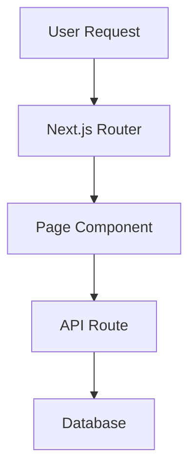
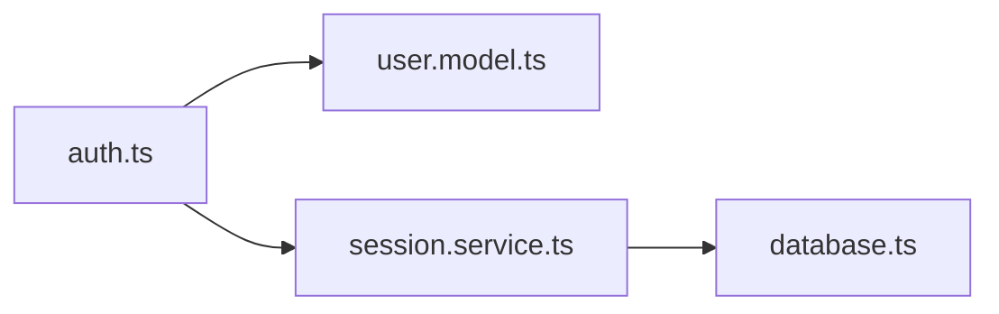

# Product Requirements Document: Code Guro MVP

## Introduction/Overview

Code Guro is a CLI tool designed to help non-technical product managers and AI-native builders understand codebases they've created or want to learn about. Many product managers are now using AI coding agents (Claude Code, Cursor, etc.) to build functional prototypes and MVPs, but lack the programming background to truly understand the code that's generated. This creates hesitation when scaling products or bringing in users.

Code Guro acts as a technical tutor, analyzing a codebase at a point in time and generating structured, beginner-friendly learning documentation. Unlike conversational AI tools that answer specific questions, Code Guro proactively creates a complete curriculum tailored to a specific codebase, explaining architecture, patterns, key files, and potential pitfalls.

The tool will be open-source and shareable, distributed via PyPI, allowing other non-technical builders to gain confidence in understanding their code.

### Etymology

The name "Code Guro" is a play on two words:
- **"Guro"** - Tagalog (Filipino) word for "teacher"
- **"Guru"** - Expert or master in a particular field

This reflects the tool's purpose: to serve as both a teacher (guro) and expert guide (guru) for understanding code.

## Key Assumptions

These assumptions guide the MVP design and should be validated during development:

1. **Target user technical level:** Users are non-technical PMs who can navigate a terminal and run basic commands (pip install, cd, ls) but have minimal to no programming experience
2. **Codebase size:** Typical analyzed codebases will be 10-500 files, with most under 100K lines of code (single-developer MVP/prototype scale)
3. **Internet reliability:** Users have stable internet connections; brief disconnections are acceptable but extended offline work is not required
4. **API cost acceptability:** Users are willing to spend $0.10-$5.00 per analysis run; costs exceeding $1 require explicit confirmation
5. **Learning time commitment:** Users will spend 30-120 minutes reading generated documentation per codebase
6. **English proficiency:** Users are comfortable reading technical documentation in English
7. **Platform distribution:** 70% macOS, 20% Linux, 10% Windows (based on developer tool demographics)
8. **Python availability:** Target users either have Python installed or can follow instructions to install it
9. **Use case frequency:** Users will analyze 3-10 different codebases over the tool's lifetime, not hundreds
10. **Documentation shelf life:** Point-in-time snapshots remain useful for 2-4 weeks before codebases change significantly

## Goals

1. **Build technical confidence:** Enable non-technical product managers to understand AI-generated code well enough to feel confident shipping products with users
2. **Create structured learning:** Generate comprehensive, beginner-friendly learning documentation organized in digestible sections
3. **Enable reusability:** Allow users to run the tool on multiple codebases to create distinct learning guides for each project
4. **Support community learning:** Make the tool publicly available for other AI-native builders facing the same challenges
5. **Prioritize clarity over completeness:** Focus on the 20% of code that represents 80% of critical logic, avoiding overwhelm

## MVP Phase 1 Priorities

This section clarifies which features are critical for the initial MVP release versus which can be deferred or are optional enhancements.

### Critical Path (Must-Have for MVP)

These features are essential for the MVP to provide value and must be implemented:

1. **Core analysis functionality** - Analyze local directories and GitHub repos
2. **Structured markdown documentation generation** - Separate files organized by section (overview, architecture, core files, etc.)
3. **Visual diagrams** - Mermaid diagrams embedded in markdown files
4. **Framework detection** - Detect common frameworks and provide framework-specific context
5. **Interactive drill-down mode** - `explain` command with `--interactive` flag for deeper exploration
6. **API key configuration** - `configure` command and secure storage
7. **Cost estimation and confirmation** - Warn users before expensive operations
8. **Basic error handling** - Clear error messages for common failure scenarios
9. **Progress indicators** - Show users what's happening during analysis
10. **PyPI distribution** - Installable via `pip install code-guro`

### Important but Flexible (Should-Have for MVP)

These features significantly enhance the experience but could be simplified if needed:

1. **HTML output option** - Provides better readability but markdown alone is functional
2. **Chunking for large codebases** - Critical for very large projects, but can start with size warnings and handle later
3. **Comprehensive framework detection** - Start with top 5-6 frameworks, expand list later

### Post-MVP Enhancements (Could-Have)

These features add polish but can be deferred to future releases:

1. **Caching mechanism** - Optimize for re-running on same codebase
2. **Advanced progress indicators** - Detailed token counts, time estimates
3. **Sample outputs in repo** - Add after MVP testing across multiple codebases
4. **Detailed troubleshooting guide** - Build based on actual user issues

## User Stories

### Primary User: Non-Technical Product Manager

**As a** non-technical product manager using AI to build products,
**I want to** understand what my codebase does and why it's structured a certain way,
**So that** I can confidently discuss technical decisions, evaluate AI-generated code quality, and feel comfortable bringing users to my product.

**As a** PM with multiple AI-built projects,
**I want to** run Code Guro on different codebases,
**So that** I can build systematic understanding across all my projects.

**As a** beginner learning to read code,
**I want** documentation that explains file extensions, architecture patterns, and framework conventions,
**So that** I can build foundational knowledge without getting lost in jargon.

**As a** user analyzing a codebase,
**I want to** explore specific folders or files in more depth after getting the overview,
**So that** I can dive deeper into areas relevant to my learning goals.

### Secondary User: Other AI-Native Builders

**As a** developer using Code Guro on unfamiliar codebases,
**I want** clear architectural explanations and visual diagrams,
**So that** I can quickly orient myself in a new project.

**As a** bootcamp graduate or junior developer,
**I want** to see real examples from production code,
**So that** I can learn practical patterns beyond tutorials.

## Functional Requirements

### Core Analysis & Generation

1. Code Guro must accept a local directory path as input for analysis
2. Code Guro must accept a GitHub repository URL as input for analysis (by cloning it locally)
3. Code Guro must analyze the codebase structure, tech stack, and architecture using the Claude API
4. Code Guro must identify the 20% of files that represent 80% of critical application logic
5. Code Guro must generate structured learning documentation organized into separate markdown files by section
6. The generated documentation must include:
   - Executive summary (what the app does, tech stack, high-level architecture)
   - Getting oriented (file structure, folder purposes, file extension glossary, entry points)
   - Core concepts (patterns, framework conventions, architectural decisions)
   - Deep dive sections for major modules/features (one per module)
   - Quality & pitfalls analysis (what's done well, potential issues, security considerations, common gotchas)
   - Interactive exploration guide (suggested next files to read, follow-up questions)
7. Code Guro must generate visual architecture diagrams using Mermaid syntax embedded in markdown
8. Code Guro must provide an option to generate HTML output in addition to markdown files for improved readability
   - Implemented via `--format html` flag on the `analyze` command
   - When HTML format is specified, generate both markdown and HTML versions
   - HTML files should maintain the same numbering/naming convention (e.g., `00-overview.html`)
   - HTML should include basic CSS styling for readability (clean typography, code syntax highlighting, responsive layout)
   - Mermaid diagrams must render properly in HTML output (use Mermaid.js CDN)
   - Default format is markdown; HTML is opt-in
9. Code Guro must detect common frameworks and provide framework-specific context and conventions when identified, while remaining functional for any codebase
   - **MVP framework detection list:** Next.js, React, Vue, Django, Flask, Express, Ruby on Rails
   - Detection mechanism: Examine package.json, requirements.txt, Gemfile, and key config files
   - When detected, add framework-specific sections to documentation:
     - Framework conventions (e.g., "Next.js uses file-based routing in the app/ directory")
     - Common patterns (e.g., "Django follows MTV: Models-Templates-Views architecture")
     - Framework-specific gotchas (e.g., "React hooks must follow the Rules of Hooks")
   - If no framework detected, provide generic architectural analysis
   - Framework detection should enhance (not replace) base analysis
10. All generated files must be saved in a `code-guro-output/` directory within the analyzed project
11. Files must be numbered/ordered for sequential reading (e.g., `00-overview.md`, `01-getting-oriented.md`, etc.)

### Interactive Drill-Down Mode

12. Code Guro must support an `explain` command that allows users to analyze specific folders or files in depth
    - Without `--interactive` flag: Generate a focused analysis document and print to console
    - Output includes: purpose, key patterns, how it connects to the rest of the codebase
    - Analysis is saved to `code-guro-output/explain-[path-name].md` for reference
13. The `explain` command must accept a `--interactive` flag that launches a chat session for follow-up questions
    - Interactive mode is a console-based REPL (Read-Eval-Print Loop)
    - Display welcome message: "Entering interactive mode for [path]. Ask questions or type 'exit' to quit."
    - User can ask free-form questions about the analyzed scope
    - Each question is sent to Claude API with the file/folder context
    - Responses are displayed in the console with syntax highlighting for code snippets
    - Session continues until user types `exit`, `quit`, or presses Ctrl+C
    - Conversation history is saved to `code-guro-output/explain-[path-name]-session.md` for later reference
14. Interactive mode must maintain context about the specific scope being analyzed (file/folder)
    - Claude API receives the full content of the file/folder being explained
    - System prompt instructs Claude to act as a code tutor for beginners
    - Previous questions and answers in the session are included in context
15. Interactive sessions must allow users to ask questions like "why was this pattern used?" or "what does this function do?"
    - Support natural language questions
    - Support code-specific queries (e.g., "explain the useState hook on line 42")
    - Support broader questions (e.g., "how does this connect to authentication?")

### Configuration & Setup

16. Code Guro must require users to provide their own Claude API key
    - Check for API key on every command execution
    - If missing, provide clear instructions to run `code-guro configure`
17. Code Guro must include a `configure` command for one-time API key setup
    - Prompt user: "Enter your Claude API key (get one at console.anthropic.com):"
    - Validate API key by making a small test request
    - If valid, save to config file with success message
    - If invalid, show error and prompt to try again
18. Code Guro must store API keys securely (environment variable or config file in user's home directory)
    - **Preferred method:** Store in `~/.config/code-guro/config.json` with restricted file permissions (chmod 600)
    - **Alternative method:** Support `CLAUDE_API_KEY` environment variable (takes precedence over config file)
    - Never log or display API key in console output
19. Code Guro must estimate token usage and approximate cost before running analysis
    - Count total characters in files to be analyzed
    - Use rough estimate: 1 token ≈ 4 characters
    - Calculate estimated cost based on current Claude API pricing (as of MVP: ~$3/million input tokens, ~$15/million output tokens)
    - Display estimate: "Estimated cost: $X.XX (based on ~Y tokens). Actual cost may vary."
    - Include disclaimer about output tokens being harder to estimate
20. Code Guro must ask for user confirmation before proceeding with analysis if estimated cost exceeds $1.00
    - Display: "Estimated cost ($X.XX) exceeds $1.00. Proceed? (y/n)"
    - If user enters 'y' or 'yes' (case-insensitive): Continue with analysis
    - If user enters 'n', 'no', or Ctrl+C: Abort with message "Analysis cancelled"
    - For costs under $1.00, proceed automatically (no confirmation needed)

### User Experience & Error Handling

21. Code Guro must provide clear, beginner-friendly error messages when:
    - API key is missing or invalid
    - Directory path doesn't exist
    - GitHub URL is invalid or repo can't be cloned
    - API rate limits are hit
    - Unsupported file types are encountered
22. Code Guro must show progress indicators during analysis (e.g., "Analyzing file structure...", "Generating architecture overview...")
23. Code Guro must support any codebase regardless of tech stack (web, mobile, backend, etc.)
24. Code Guro must gracefully handle edge cases like empty directories, binary files, or extremely large codebases
25. For extremely large codebases that exceed Claude's context window, Code Guro must analyze the codebase in chunks and provide clear warnings to users about the chunked analysis approach
    - **Context window limit:** Assume 200K tokens for Claude 3.5 Sonnet (conservative estimate to leave room for responses)
    - **Chunking trigger:** If total estimated tokens exceed 150K, use chunking strategy
    - **Chunking approach:**
      - **Preferred method:** Chunk by logical module/feature area (based on directory structure)
      - **Fallback method:** If no clear module structure, chunk by file count (e.g., 50 files per chunk)
    - **Chunking process:**
      1. Analyze each chunk separately with Claude API
      2. Generate partial documentation for each chunk
      3. Make a final API call to synthesize chunk results into cohesive documentation
    - **User warnings:**
      - Before chunking: "This codebase is very large (estimated X tokens). Analysis will be performed in Y chunks. This may impact cross-module insights."
      - Display: "Do you want to continue? (y/n)"
      - During chunking: Show progress "Analyzing chunk 2 of 5..."
    - **Limitations to communicate:**
      - Cross-module relationships may be less detailed in chunked analysis
      - Overall architecture view may be less comprehensive
      - Suggest: "Consider running `explain` on specific modules for deeper insights"
26. Code Guro requires internet connectivity for all operations (API calls and optional GitHub cloning)
    - Display friendly error if no internet connection detected
    - Error message: "Code Guro requires an internet connection to analyze code. Please check your connection and try again."

### Installation & Distribution

27. Code Guro must be installable via pip: `pip install code-guro`
28. Code Guro must work on macOS, Linux, and Windows
29. Code Guro must include a comprehensive README with:
    - Installation instructions
    - Setup guide (API key configuration)
    - Usage examples with sample commands
    - Links to sample output from real codebases (to be added after MVP testing)
    - Troubleshooting section

## Non-Goals (Out of Scope)

1. **Tracking codebase changes over time** - Code Guro is a point-in-time snapshot tool, not a version control or diff analyzer
2. **Modifying or generating code** - Code Guro only analyzes and documents; it doesn't write or edit code
3. **Hosting or SaaS version** - MVP is CLI-only; users must have their own API keys
4. **IDE integrations** - No VS Code extensions or editor plugins in MVP
5. **Automated testing or code quality scoring** - Focus is on teaching, not evaluation or linting
6. **Support for proprietary/closed-source AI models** - MVP uses Claude API only
7. **Real-time collaboration** - Single-user tool, not designed for team workflows
8. **Commit history analysis** - Will not analyze git history, blame, or contributors
9. **Advanced visualizations beyond Mermaid** - No interactive diagrams or external visualization tools
10. **Automatic updates to documentation** - Users must re-run the tool manually if codebase changes
11. **Multi-language support** - Generated documentation will be in English only for MVP
12. **Offline functionality** - Internet connection is required for API calls and GitHub cloning

## Design Considerations

### Output Structure

The generated learning documentation should follow this structure:

```
code-guro-output/
├── 00-overview.md           # Executive summary
├── 01-getting-oriented.md   # File structure, extensions, entry points
├── 02-architecture.md       # Patterns, decisions, tech stack deep dive
├── 03-core-files.md         # The 20% of files that matter most
├── 04-deep-dive-[module].md # One file per major module (dynamic)
├── 05-quality-analysis.md   # What's good, what's risky, pitfalls
└── 06-next-steps.md         # Suggested exploration paths, drill-down commands
```

### CLI Command Structure

```bash
# Installation
pip install code-guro

# Initial setup
code-guro configure

# Analyze current directory (markdown output - default)
code-guro analyze .

# Analyze specific path
code-guro analyze /path/to/project

# Analyze from GitHub
code-guro analyze https://github.com/user/repo

# Analyze with HTML output
code-guro analyze . --format html

# Deep dive on specific folder (generates markdown report)
code-guro explain ./src/auth

# Deep dive with console output only (no file saved)
code-guro explain ./src/auth --output console

# Interactive mode for specific file
code-guro explain ./src/auth/login.ts --interactive

# Check version
code-guro --version

# Get help
code-guro --help

# Get help for specific command
code-guro analyze --help
code-guro explain --help
```

### Visual Diagrams

Mermaid diagrams should be embedded directly in markdown files. Examples:

**Architecture diagram:**


**File relationship diagram:**


### Learning Style Support

Documentation should include:
- **Narrative explanations:** "Here's why this architecture makes sense for this type of app..."
- **Reference documentation:** "File X is responsible for Y"
- **Code examples:** Actual snippets from the analyzed codebase with inline explanations
- **Visual diagrams:** Mermaid charts showing relationships and flow
- **Glossary sections:** Explaining terms like "middleware," "ORM," "SSR," etc.

## Technical Considerations

### Technology Stack

- **Language:** Python 3.8+
- **API Integration:** Anthropic Claude API (Claude 3.5 Sonnet or later)
- **Package Distribution:** PyPI (using setuptools or poetry for build)

**Core Dependencies:**
- **`anthropic`** (required) - Official Claude SDK for API integration
  - Version: ≥0.18.0
  - Purpose: All Claude API calls for code analysis
- **`click`** (required) - CLI framework
  - Version: ≥8.0
  - Purpose: Command parsing, arguments, options, help text
- **`rich`** (required) - Terminal formatting and progress indicators
  - Version: ≥13.0
  - Purpose: Styled console output, progress bars, syntax highlighting
- **`gitpython`** (required) - For cloning GitHub repos
  - Version: ≥3.1
  - Purpose: Clone repositories from GitHub URLs
- **`python-dotenv`** (optional but recommended) - Environment variable management
  - Version: ≥1.0
  - Purpose: Load API keys from .env files during development
- **`tiktoken`** (required) - Token estimation
  - Version: ≥0.5.0
  - Purpose: Accurate token counting for cost estimation
- **`markdown`** (required for HTML output) - Markdown to HTML conversion
  - Version: ≥3.4
  - Purpose: Convert .md files to .html when --format html is used
  - Extensions needed: fenced_code, tables, toc

**Optional Dependencies (for enhanced experience):**
- **`prompt_toolkit`** - Rich interactive prompts
  - Purpose: Better REPL experience with history and auto-complete
  - Can fallback to basic `input()` if not available
- **`pygments`** - Syntax highlighting in HTML output
  - Purpose: Code syntax highlighting in generated HTML files

### File System Operations

- Must handle various file encodings (UTF-8, ASCII, etc.)
- Should skip binary files, images, and other non-text files
- Should respect `.gitignore` patterns when analyzing repositories
- Must handle symbolic links and nested directory structures

### API Usage & Cost Management

- Estimate tokens before API calls using approximate character counts
- Batch file contents intelligently to minimize API calls
- Provide cost estimates based on current Claude API pricing
- Cache analysis results locally to avoid re-analyzing unchanged codebases (optional optimization)
- For large codebases exceeding context limits, implement chunking strategy:
  - Analyze codebase in logical chunks (by module, feature area, or file count)
  - Warn users about chunked analysis and potential impact on cross-module insights
  - Ensure each chunk produces coherent documentation that can be merged into final output

### HTML Output Generation

When `--format html` flag is used, Code Guro must convert markdown documentation to HTML with enhanced readability:

**Conversion Approach:**
- Use a Python markdown-to-HTML library (e.g., `markdown` or `python-markdown`)
- Generate both .md and .html versions of all documentation files
- Maintain identical file structure and naming (just change extension)

**HTML Styling Requirements:**
- Include embedded CSS in each HTML file (no external stylesheets)
- Use clean, readable typography (e.g., system fonts, adequate line spacing)
- Implement syntax highlighting for code blocks (use Pygments or highlight.js)
- Ensure responsive layout (readable on desktop and mobile)
- Add navigation links between sections at top of each page

**Mermaid Diagram Rendering:**
- Include Mermaid.js from CDN in HTML files: `<script src="https://cdn.jsdelivr.net/npm/mermaid/dist/mermaid.min.js"></script>`
- Initialize Mermaid on page load
- Mermaid code blocks should render as interactive diagrams

**HTML Structure Template:**
```html
<!DOCTYPE html>
<html>
<head>
    <meta charset="UTF-8">
    <meta name="viewport" content="width=device-width, initial-scale=1.0">
    <title>Code Guro - [Section Name]</title>
    <style>/* Embedded CSS here */</style>
    <script src="https://cdn.jsdelivr.net/npm/mermaid/dist/mermaid.min.js"></script>
</head>
<body>
    <nav><!-- Links to other sections --></nav>
    <main><!-- Converted markdown content --></main>
</body>
</html>
```

**Performance Considerations:**
- HTML generation should add minimal overhead (<2 seconds for typical codebases)
- Can be parallelized (convert markdown to HTML after generation is complete)

### Interactive REPL Implementation

The `--interactive` flag for the `explain` command creates a console-based Read-Eval-Print Loop:

**Technical Requirements:**
- Use Python's `input()` for user prompts (simple, works cross-platform)
- Alternative: Consider `prompt_toolkit` library for richer experience (history, auto-complete) if time permits
- Display styled output using `rich` library for syntax highlighting and formatting

**Session Flow:**
1. **Initialization:**
   - Load file/folder content into memory
   - Create system prompt for Claude: "You are Code Guro, a patient code tutor helping beginners understand this code. Explain concepts clearly with examples."
   - Display welcome message with instructions
2. **REPL Loop:**
   - Display prompt: `code-guro> `
   - Wait for user input
   - Check for exit commands (`exit`, `quit`, Ctrl+C)
   - Send question + file context to Claude API
   - Display response with syntax highlighting
   - Save Q&A to session log
   - Repeat
3. **Exit:**
   - Save full conversation to `explain-[path]-session.md`
   - Display: "Session saved to code-guro-output/explain-[path]-session.md"

**Context Management:**
- Include full file/folder content in every API request
- Maintain conversation history (last 10 Q&A pairs to stay within token limits)
- If context grows too large, warn user and offer to start fresh session

**Error Handling in Interactive Mode:**
- Network errors: Display error, allow retry without exiting session
- API rate limits: Show wait time, pause session
- Invalid questions: Claude handles gracefully via system prompt

### Framework Detection & Context

**MVP Framework Support List:**
1. **Next.js** - Detect via: package.json contains "next", presence of next.config.js
2. **React** - Detect via: package.json contains "react", .jsx/.tsx files
3. **Vue** - Detect via: package.json contains "vue", .vue files
4. **Django** - Detect via: requirements.txt contains "Django", presence of manage.py or settings.py
5. **Flask** - Detect via: requirements.txt contains "Flask", app.py or wsgi.py patterns
6. **Express** - Detect via: package.json contains "express", typical Express app structure
7. **Ruby on Rails** - Detect via: Gemfile contains "rails", presence of config/routes.rb

**Detection Implementation:**
- Examine package manifests first (package.json, requirements.txt, Gemfile)
- Check for framework-specific config files as secondary confirmation
- Look for framework-specific directory patterns (e.g., app/ for Next.js, views.py for Django)
- Allow multiple frameworks to be detected (e.g., Next.js + React)

**Framework-Specific Context to Include:**
- **Architecture patterns:**
  - Next.js: File-based routing, Server/Client Components, App Router vs Pages Router
  - Django: MTV (Model-Template-View) architecture
  - Rails: MVC with convention-over-configuration
- **Key conventions:**
  - Next.js: Special files (layout.tsx, page.tsx, loading.tsx)
  - Express: Middleware chain pattern
  - Flask: Application factory pattern, blueprints
- **Common gotchas:**
  - React: Rules of Hooks, component re-rendering
  - Next.js: Server vs Client component boundaries
  - Django: N+1 query problems, migration conflicts

**Fallback Behavior:**
- If no framework detected: Provide generic architectural analysis
- Focus on: file organization, module structure, separation of concerns
- Framework detection enhances but never replaces base analysis

### Error Handling

Must gracefully handle:
- Network failures during GitHub cloning
- API timeouts or rate limiting
- Malformed or corrupted files
- Extremely large files (>1MB)
- Unsupported languages or frameworks

### Security Considerations

- API keys must never be logged or printed to console
- Should warn users if analyzing codebases with potential secrets (.env files, API keys in code)
- Must not transmit API keys to any service other than Anthropic's official API
- Should validate and sanitize file paths to prevent directory traversal attacks

## Success Metrics

### Quantitative Metrics

1. **Adoption:** 10+ unique users (beyond the creator) successfully install and run Code Guro within 3 months of public release
2. **Multi-codebase validation:** Creator successfully analyzes at least 3 different types of codebases (e.g., Next.js app, React Native app, Python backend)
3. **Community feedback:** 5-10 non-technical PMs provide positive feedback on usefulness
4. **Error rate:** <5% of analysis runs result in errors or failures (based on user reports or telemetry if added)

### Qualitative Metrics

5. **Personal confidence:** Creator reports feeling more confident understanding their AI-generated codebases after using Code Guro
6. **Documentation quality:** Generated documentation is comprehensible to someone with no programming background
7. **Learning effectiveness:** Users can explain architectural decisions in their codebase after reading the generated docs
8. **Usability:** Users can install and run Code Guro without needing technical support

### Success Indicators

- Users share their generated learning docs with technical advisors/potential hires for validation
- Users request additional features or contribute to the open-source repo
- Users report feeling comfortable bringing beta users to their AI-built products after using Code Guro
- Tool generates GitHub stars/forks indicating community interest

## Open Questions

1. **Update mechanism:** If a user makes changes to their codebase, should they re-run full analysis or is there a way to do incremental updates?

2. **Telemetry:** Should Code Guro include anonymous usage analytics (with opt-out) to understand which features are most valuable?

3. **Community contributions:** What level of code review/quality bar should be established for accepting community PRs?

4. **Cost ceiling:** What's a reasonable maximum cost per analysis run? Should there be a hard cap or just a warning?

---

**Document Version:** 2.0
**Last Updated:** 2025-12-28
**Status:** Ready for Development

**Changelog:**
- v2.0: Major enhancement with verbose implementation details
  - Added Etymology section explaining "Code Guro" name origin (Tagalog "teacher" + "guru")
  - Added Key Assumptions section (10 assumptions about users, codebases, costs, and usage patterns)
  - Added MVP Phase 1 Priorities section (Critical Path, Important but Flexible, Post-MVP)
  - Enhanced functional requirements with detailed specifications for:
    - HTML output format (--format flag, CSS styling, Mermaid.js rendering, navigation)
    - Framework detection (specific list of 7 frameworks: Next.js, React, Vue, Django, Flask, Express, Rails)
    - Interactive REPL mode (session flow, context management, error handling, exit commands)
    - Cost threshold ($1.00 confirmation threshold, token estimation formula, pricing details)
    - Chunking strategy (150K token trigger, module-based chunking, synthesis step)
    - Configuration storage (~/.config/code-guro/config.json, environment variable fallback)
  - Enhanced CLI command structure with all flags and options (--format, --interactive, --output)
  - Added detailed Technical Considerations sections for:
    - HTML Output Generation (conversion libraries, CSS approach, Mermaid CDN integration)
    - Interactive REPL Implementation (REPL loop flow, prompt format, session saving)
    - Framework Detection (detection signals, context to include, fallback behavior)
  - Enhanced dependency list with specific versions, purposes, and required vs. optional classification
  - Total enhancement: ~75% → 95%+ implementation clarity for implementation agent
- v1.1: Incorporated decisions on framework detection, chunking strategy, HTML output, internet requirement, multi-language scope, and sample codebase timing
- v1.0: Initial PRD draft
